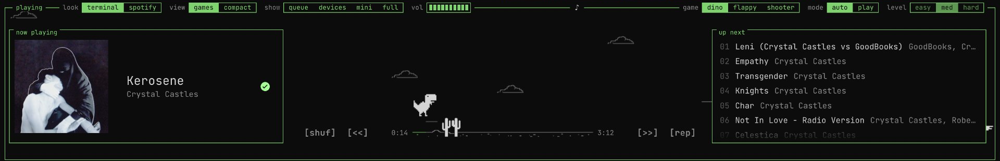

# Spotify Minigame UI

A Spicetify theme that turns Spotify's player bar into a small arcade. The playback bar becomes the ground for three games that play along with whatever song is on, synced to its beat.

Developed by [@iamtava](https://x.com/iamtava) on X and [@tava](https://instagram.com/tava) on Instagram.



## What it does

- **Three games on the playback bar:** the Chrome dino, flappy, and a side-scrolling shooter.
  - **Auto** mode plays itself along with the song.
  - **Play** mode is yours: `↑` jumps or flaps, `↓` ducks, and the shooter moves with `↑` `↓`.
  - Space stays Spotify's play/pause. Crashing pauses the song, and resuming starts a new run.
- **Synced to the music:** it reads Spotify's audio analysis for each song.
  - Obstacles land on the beat, and loud sections put one on every beat.
  - Flappy's gravity follows the tempo, so you flap in time.
  - The shooter's gun fires on the beat and the aliens march to it.
  - On auto, the difficulty follows the song's BPM.
- **Lyrics** scroll one line at a time along the top border.
- **Up next:** the queue sits on the right. Click a song to play it.
- **Listening stats** on Home: session, today and this month, plus top songs and artists.
- **Two looks:** the terminal look (monospace, green borders, green halftone artwork) or Spotify's own look, keeping the layout and the games.
- **Two views:** the tall games view, or a compact player bar with no games.

## Install with your AI assistant

Paste this into an AI coding assistant that can run commands on your computer, and it will do the install for you:

```text
Install the Spotify Minigame UI theme on my computer:

1. Install Spicetify if it isn't installed:
   - macOS or Linux: curl -fsSL https://raw.githubusercontent.com/spicetify/cli/main/install.sh | sh
   - Windows (PowerShell): iwr -useb https://raw.githubusercontent.com/spicetify/cli/main/install.ps1 | iex
   If Spotify on Windows came from the Microsoft Store, stop and tell me to reinstall it from spotify.com first.
2. Clone https://github.com/lukerodriguez8/spotify-minigame-ui into the Spicetify Themes folder as "spotify-minigame-ui"
   (~/.config/spicetify/Themes on macOS and Linux, %APPDATA%\spicetify\Themes on Windows).
3. Run: spicetify config current_theme spotify-minigame-ui color_scheme tty inject_theme_js 1 inject_css 1 replace_colors 1
4. Run: spicetify backup apply (or spicetify apply if a backup already exists).
5. Tell me when it's done. Spotify will restart with the theme on.
```

## Install by hand

1. Install [Spicetify](https://spicetify.app/docs/getting-started).
2. Clone this repo into your Spicetify Themes folder:
   - macOS and Linux: `~/.config/spicetify/Themes`
   - Windows: `%APPDATA%\spicetify\Themes`

   ```bash
   git clone https://github.com/lukerodriguez8/spotify-minigame-ui ~/.config/spicetify/Themes/spotify-minigame-ui
   ```

3. Turn it on:

   ```bash
   spicetify config current_theme spotify-minigame-ui color_scheme tty inject_theme_js 1 inject_css 1 replace_colors 1
   spicetify backup apply
   ```

   The first time, use `spicetify backup apply`. After that, `spicetify apply` is enough.

Color schemes: `tty` (default), `amber` and `green`. Switch with `spicetify config color_scheme amber && spicetify apply`.

## Good to know

- **Where the switches are:** the controls sit on the player bar's top border: game, mode, level, look and view.
- **When the beat data is missing:** beat sync and lyrics come from Spotify's own client endpoints. Songs without analysis, and podcasts or local files, play the games without beat sync.
- **How stats are counted:** the theme keeps the stats itself, in local storage, from the day you install it. A play counts after 30 seconds of listening. Only listening in this Spotify app is counted.
- **What it's tested on:** Spotify 1.3.0 with Spicetify 2.45 on macOS. A Spotify update can move things around; if the theme disappears after one, run `spicetify backup apply`.

## Credits

The dino sprites and game constants come from Chromium's dino game (`components/neterror/resources/dino_game`), Copyright The Chromium Authors, under a BSD-style license. See [LICENSE](LICENSE). Everything else, including the flappy and shooter art, is original.

## License

MIT, except the Chromium dino sprites and constants, which keep their BSD license. Both are in [LICENSE](LICENSE).
